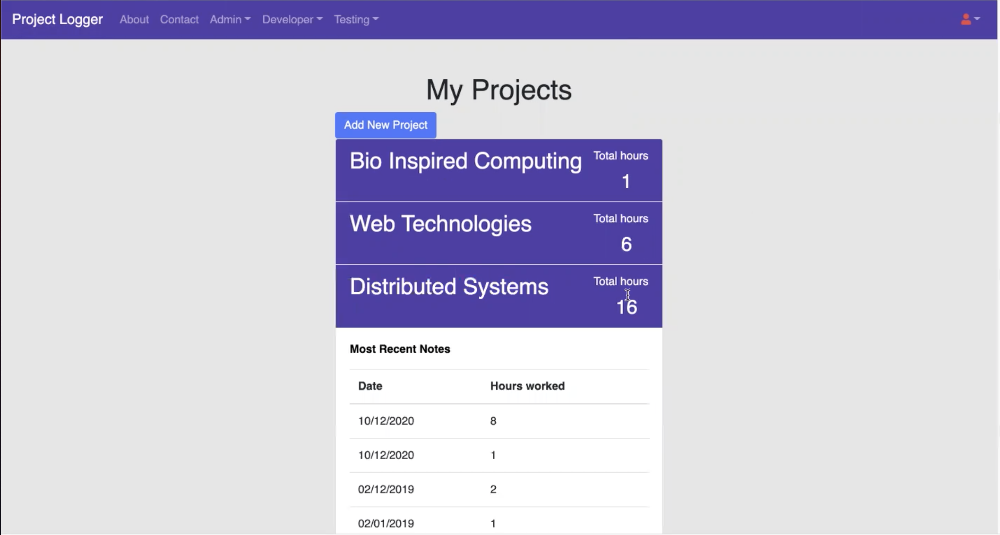

# Project Logger

## General
Web Application that allows user to log work done on their personal or work projects.

Core features include:
- Time logging
- Task Description
- Task File Upload/download
## Technologies
project created using:
- PHP
- Twig
- RedBean ORM
- [The Framework](https://github.com/rivets/framework2)
## Setup
Follow the instructions for your operating system at:

[http://catless.ncl.ac.uk/framework/docs/installation](http://catless.ncl.ac.uk/framework/docs/installation)

Once installation is completed replace the <b>www</b> directory with this project

